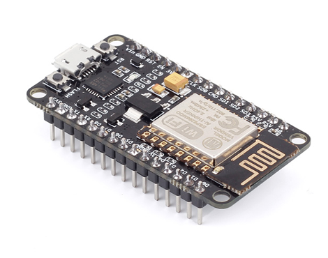

# IV-Project:
## Centro de control de luces domésticas

Se pretende realizar un microservicio a través del cual se puedan controlar un número determinado de luces conectadas a arduinos con módulos Wi-Fi (ESP8266), específicamente los dispositivos **NodeMCU**.

Cada luz podrá tener su propio dispositivo nodeMCU si se encuentran muy separadas, pero con un solo ESP8266 podremos controlar más de una luz.

El proyecto seguramente se desarrolle en **python** pero aún no está decidido.

Como alternativa a posibles tempranas complicaciones optaré por el **plan B:** un sistema de reservas para un restaurante.