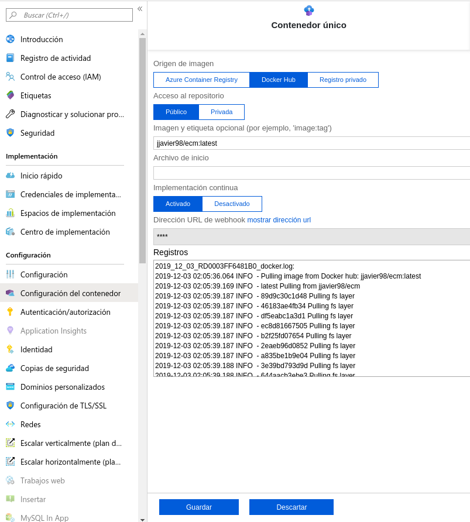

# Azure
El despliegue en Azure es ultra sencillo desde un contenedor en DockerHub. Tan solo deberemos crear una nueva _'App Services'_ y rellenar los campos básicos seleccionando en el apartado _'Publicar'_ la opción 'Contenedor de Docker'. El resto de campos los rellenamos según queramos nuestra configuración. Una vez listo hacemos click en _'Revisar y Crear'_.

Una vez revisado vamos al apartado _'Configuración del contenedor'_. Allí seleccionamos la plataforma 'DockerHub' el repositorio del contenedor y activamos la implementación contínua para que cada vez que se actualice el contenedor en su repositorio se actualice el despliegue de esta API. Pulsamos en _'Guardar'_ y queda listo el despliegue.

