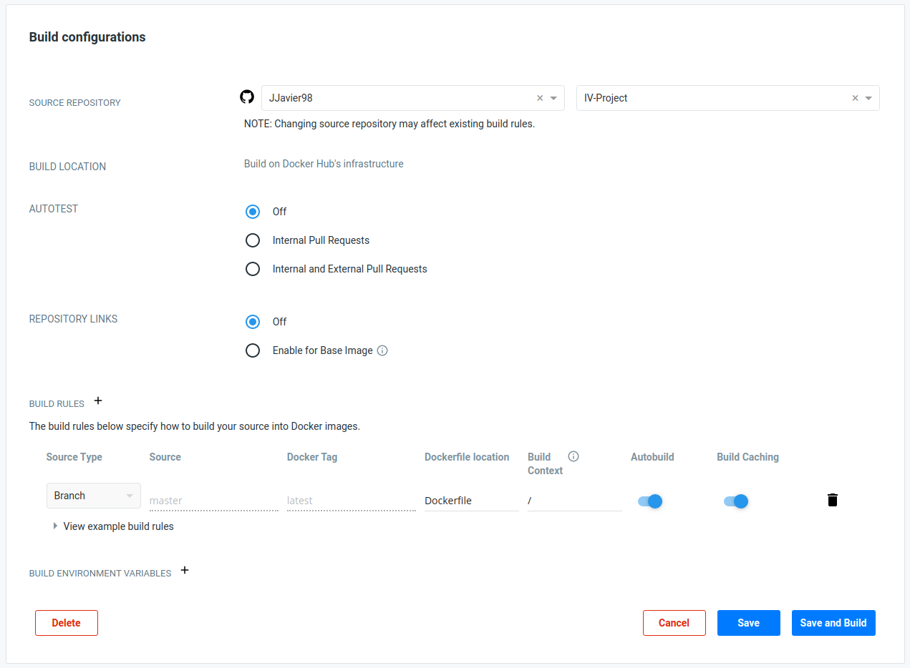
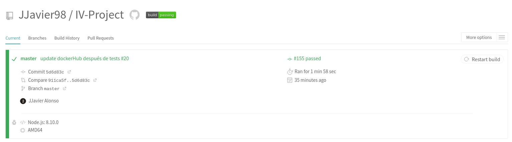
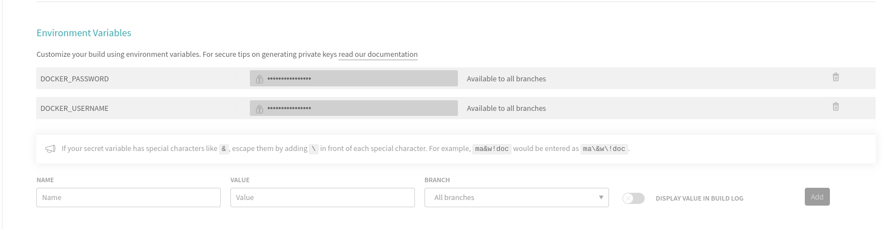

# Docker
Para crear un contenedor con nuestra API vamos a usar el servicio de contenedores Docker. Para configurar el proceso necesitaremos crear un archivo _Dockerfile_ y, aunque no obligatorio, un _.dockerignore_.

## Dockerfile
Este archivo contiene todos los comandos que se ejecutarán para crear el contenedor. Podemos ser muy específicos indicando cuáles son los archivos que queremos incorporar en nuestro contenedor o permitirnos ser algo más generales e indicar qué archivos no incluir especificándolos en _.dockerignore_. El Dockerfile tiene la siguiente forma:

```python
# Imagen a partir de la imagen oficial de Node con Alpine
FROM node:8-alpine

# Información del autor
LABEL maintainer='José Javier Alonso (jjavier.ar98@gmail.com)'

# Creamos el directorio de trabajo de nuestro proyecto
WORKDIR /ecm

# Puerto
ENV PORT 8888

# Copiamos los archivos necesarios para el funcionamiento de la aplicación
COPY package.json ./
COPY src ./src
COPY db ./db
COPY config ./config
COPY gulpfile.js ./

# Instalamos las dependencias del proyecto
RUN npm install

# Comando para desplegar el servicio
CMD ["node", "node_modules/.bin/gulp", "start-docker"]

EXPOSE 8888
```

## .dockerignore
En este archivo declaramos todos aquellos ficheros que no queremos que sean incluidos en nuestro contenedor. Esto nos permite ser más generales en los archivos que incluimos con el Dockerfile para después ser más finos especificando cuáles son los que no queremos. Nuestro _.dockerignore_ pinta de la siguiente manera:

```python
node_modules
npm-debug.log
```

## Creación
Una vez tenemos los dos archivos listos podemos proceder a crear el contenedor.

```bash
$ docker build -t ecm .
```

'-t' nos permite nombrar al contenedor creado.
'ecm' es el nombre asignado.
'.' es el directorio donde se encuentra el Dockerfile.

Tras la ejecución podemos comprobar que disponemos del contenedor ejecutando la orden:

```bash
$ docker build images

REPOSITORY          TAG                 IMAGE ID            CREATED             SIZE
ecm                 latest              7819e5898c86        19 seconds ago      244MB
jjavier98/ecm       latest              6e5d3bb489f8        20 hours ago        245MB
<none>              <none>              2134744511a3        20 hours ago        245MB
node                8-alpine            26881633664e        2 weeks ago         67MB
ubuntu              latest              2ca708c1c9cc        2 months ago        64.2MB
hello-world         latest              fce289e99eb9        11 months ago       1.84kB
```

## Ejecución local

Como vemos el contenedor _ecm_ aparece como recientemente creado.

Para probar su funcionamiento de manera local lo podemos ejecutar.

```bash
$ docker run -p 8888:8888 -d ecm
```

'-p' nos permite especificar el puerto de conexión.
'-d' lanza la ejecución en segundo plano para no dejar ocupada la terminal.
'ecm' es el nombre del contenedor que lanzamos.

# DockerHub

Una vez que tenemos nuestra imagen creada y hemos probado que funciona podemos subirla a DockerHub. Para ello debemos seguir los siguientes pasos:

1. _Logearnos_ en docker
    ```bash
    docker login
    ```
2. Añadir un tag con nuestro nombre de usuario y la versión del contenedor
    ```bash
    docker tag ecm jjavier98/ecm:latest
    ```
    'jjavier98' es mi nombre de usuario en DockerHub.
    'ecm' el container que queremos subir.
    'latest' una etiqueta que describe la versión del container.  

3. Hacer push
    ```bash
    docker push jjavier98/ecm:latest
    ```

- Si queremos descargar nuestro contenedor con la imagen de nuestro servicio tan solo tendremos que hacer:
```bash
docker pull jjavier98/ecm:latest
```

Tras esto nuestro contenedor se habrá subido a la plataforma DockerHub y estará a disposición de toda la comunidad.

## Construcción Automática

Una vez nuestro contenedor se encuentra en DockerHub podemos hacer que se actualice de manera automática cada vez que realizamos un push a nuestro repositorio de GitHub. Esto nos ahorra tener que estar preocupándonos de ejecutar las órdenes de construcción, login, tag y push.  

En nuestro perfil de DockerHub entramos en el contenedor que nos interesa automatizar y entramos al apartado de _'Builds'_. Aquí tendremos que indicar cuál es el repositorio de GitHub que hace referencia al contenido del container y marcar las opciones de _Autobuild_ y aunque no es obligatoria la de _BuildCaching_. La primera opción es la que actualizará el contenedor por cada push realizado al repositorio de GitHub, la segunda aprovechará los datos almacenados en caché de la anterior _build_ del contenedor para tardar menos. Por último haremos click en ***Save & Build*** y estará listo.



## Construcción Automática - TravisCI
La opción anterior tiene el inconveniente de que, independientemente de si nuestros cambios en el microservicio son correctos o no, al hacer el _push_ a GitHub el contenedor será actualizado. Para evitar actualizar el contenedor con una versión con fallos vamos a realizar esta actualización en DockerHub desde TravisCI tras pasar los tests correspondientes al microservicio.

Al archivo de configuración de TravisCI (_.travis.yml_) debemos añadirle las siguientes líneas:  
Al principio del archivo:
```bash
sudo: 'required'
services:
  - 'docker'
```
Esto indicará que el comando 'sudo' es necesario y va a ser utilizado y que se requiere del servicio 'docker' para ejecutar próximas órdenes.

Y por último, la ejecución de un script donde agrupamos todas las órdenes de despliegue.
```bash
  - bash docker_travis.sh
```

Al final, ._travis.yml_ tendrá el siguiente aspecto:

```bash
sudo: 'required'
services:
  - 'docker'
# Lenguaje utilizado
language: node_js
# Versión del lenguaje utilizada
node_js:
  - 8.10.0
# Comando para instalar las dependencias
install:
  - npm install
# Scripts a ejecutar para realizar los tests
script:
  - node node_modules/.bin/gulp test
  - bash docker_travis.sh
```

El script para el despliegue en Docker es _docker_travis.sh_ y consta de:
```bash
#!/bin/bash

# Login
echo "$DOCKER_PASSWORD" | docker login -u "$DOCKER_USERNAME" --password-stdin
# Build
docker build -t ecm .
# Tag
docker tag ecm jjavier98/ecm:latest
# Push
docker push jjavier98/ecm
```

Las variables DOCKER_PASSWORD y DOCKER_USERNAME son variables de entorno declaradas en TravisCI. Para ello tendremos que ir a nuestro repositorio en TravisCI e ir al apartado _More options/Settings_



Una vez ahí nos desplazamos hasta el apartado _Environment Variables_ y declaramos estas dos variables con los valores de nuestro usuario y contraseña en DockerHub.

