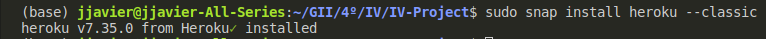

## Heroku

Para hacer el despliegue gratuito de nuestro servicion en el PaaS Heroku lo podemos hacer de dos maneras. Bien mediante el toolbelt administrado por Heroku o asociando el despliegue a un servicio de control de versiones como GitHub. Aunque decidamos optar por la segunda opción, la mayoría de los pasos de la "versión" Toolbelt son comunes. Vamos a explicar paso a paso ambos casos pero hay que indicar también que la propia página de Heroku tiene un tutorial para realizar estos pasos $\rightarrow$ [tutorial de Heroku](https://devcenter.heroku.com/start)

## Mediante Toolbelt

### Registro

En primer lugar debemos crearnos una cuenta en [Heroku](https://signup.heroku.com/dc).

### Instalación del Toolbelt o CLI


Para todas estas distribuciones de Linux usaremos el comando:

```bash
sudo snap install heroku --classic
```
Obtendremos una salida que nos informará de la versión que se ha instalado.


### Login

Una vez instalado haremos _log in_. Este comando abrirá nuestro navegador y nos pedirá iniciar sesión.

```bash
heroku login
```

Una vez consigamos "_loguearnos_" es un buen momento para cerciorarnos de que tenemos node, npm y git instalados. En caso negativo debemos instalarlos.

### Crear una aplicación en Heroku

Accedemos al directorio de nuestra API y ejecutamos el siguiente comando:

```bash
heroku apps:create --region eu nombre_API
```

- eu: Hace refencia a la región europea.
- nombre_API: Es el nombre que le quieras dar a tu API en Heroku.

### Definir ejecución

Dentro del directorio de nuestra API (en la raíz) debemos crear un fichero llamado _Procfile_ en el que indicaremos el comando a ejecutar para el despliegue del servicio.

```bash
web: node src/indes.js
```